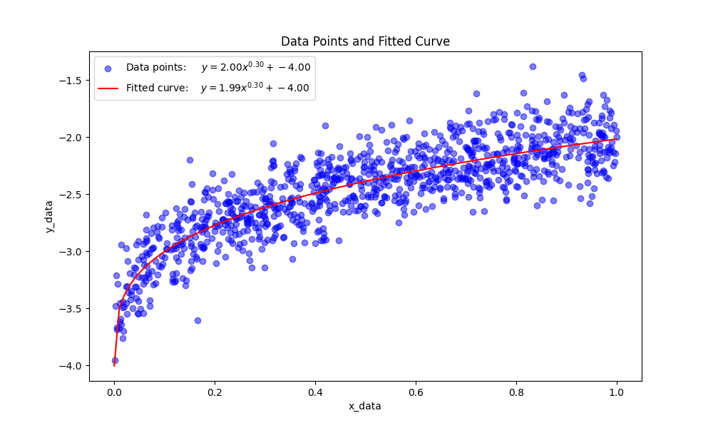
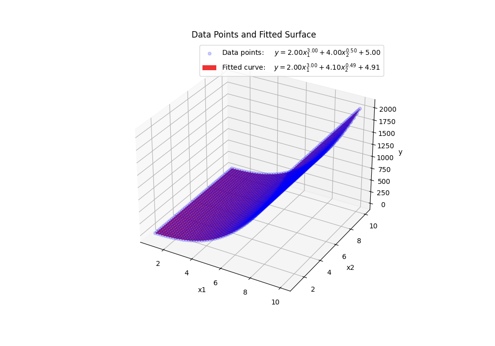

# Power Regression

This repository provides guidance on fitting a power regression model of the form $$y = w_1 \cdot X^{w_2} + \beta$$

## Overview
This guide explains how to use it to fit a power regression model.

## Steps to Fit Power Regression
1. **Define the Model Function**:
   - Specify the model function $$f(x; w_1, w_2, \beta) = w_1 \cdot X^{w_2} + \beta$$, where $w_1$, $w_2$, and $\beta$ are the parameters to be estimated.

2. **Provide Initial Guesses**:
   - Supply initial guesses for the parameters $w_1$, $w_2$, and $\beta$. Accurate initial guesses can significantly impact the fitting process.

3. **Compute Residuals**:
   - Calculate the residuals, which are the differences between the observed data and the model's predicted values with the current parameter estimates.

4. **Optimize Parameters**:
   - Use the optimization algorithm (e.g., Levenberg-Marquardt) to iteratively adjust the parameters $w_1$, $w_2$, and $\beta$ to minimize the sum of squared residuals.

5. **Evaluate Convergence**:
   - Check if the optimization converges. If not, consider refining your initial guesses or constraints to achieve convergence.

## Disadvantages
- **Potential for Non-Convergence**:
  - The function may not always converge to a solution, especially with suboptimal initial guesses or complex datasets. If convergence issues arise, exploring different initial parameter values or alternative fitting methods might be necessary.

## Visuallization

## Example Usage
Feel free to explore the code in this repository for practical examples and additional guidance.